

  

<h1 align="center">Chanchito</h1>

  <strong>App de finanzas personales local-first — sin backend, sin base de datos externa, con privacidad total y respaldos cifrados. PWA instalable y app nativa para iPhone a partir del mismo código.</strong>

  
  
  
  
  
  
  

---

> **Nota sobre este repositorio**: Este repositorio es una vitrina técnica (*showcase*) del proyecto. El código fuente de desarrollo es privado al tratarse de una aplicación de uso personal que gestiona mis finanzas reales. Aquí se documentan las decisiones de arquitectura, diseño de sistemas y características técnicas implementadas.

---

## 📸 Capturas de Pantalla

_Todas las cifras, saldos, comercios y movimientos de estas capturas son **datos sintéticos** generados por un script determinístico — no representan información financiera real. Capturas en viewport de iPhone (390×844 @3x), tema oscuro._

### Resumen y movimientos

<table>
  <tr>
    <td width="33%" valign="top">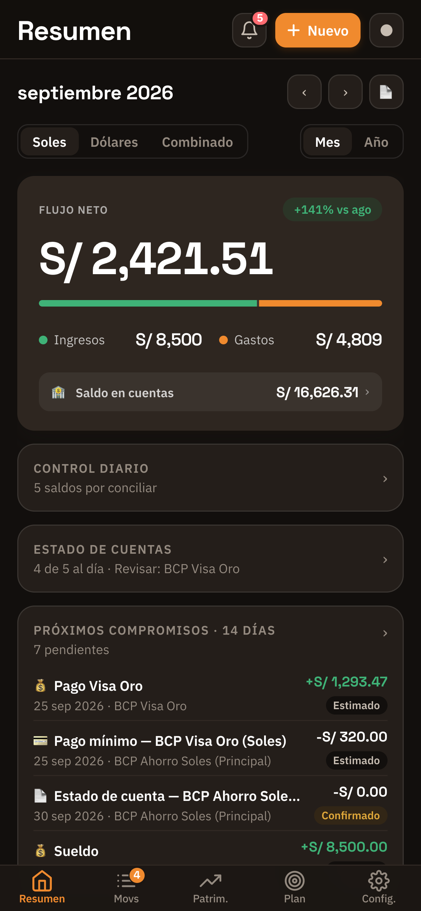</td>
    <td width="33%" valign="top">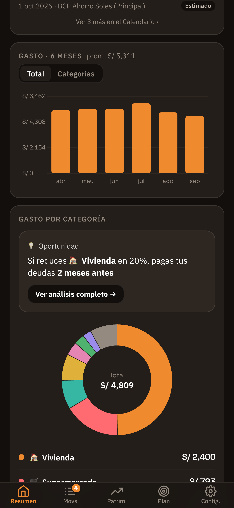</td>
    <td width="33%" valign="top">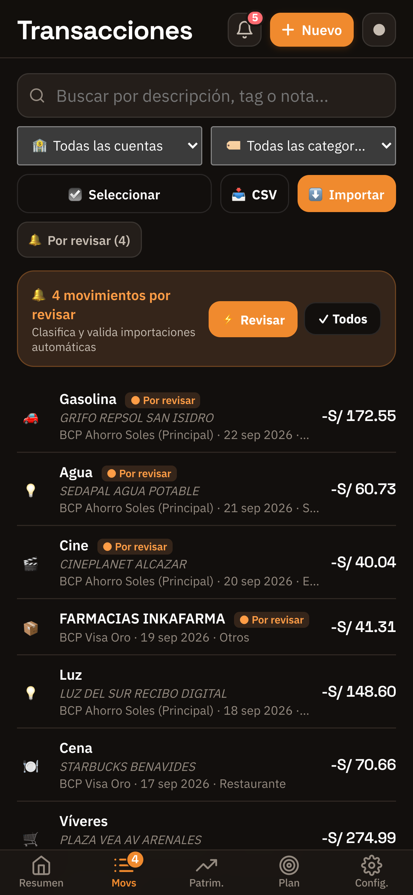</td>
  </tr>
  <tr>
    <td valign="top"><strong>Resumen.</strong> Flujo neto del mes (caja real, no "ingresos − gastos"), saldo en cuentas, control diario de extractos y conciliaciones, y próximos compromisos a 14 días.</td>
    <td valign="top"><strong>Gasto en el tiempo.</strong> Barras de 6/12 meses con vista apilada por categoría y donut interactivo, dibujados a mano en SVG sin librerías.</td>
    <td valign="top"><strong>Inbox de revisión.</strong> Todo lo importado entra como "por revisar" hasta que lo confirmas; búsqueda, filtros, selección múltiple y edición masiva.</td>
  </tr>
</table>

### Importación sin confiar a ciegas

<table>
  <tr>
    <td width="33%" valign="top">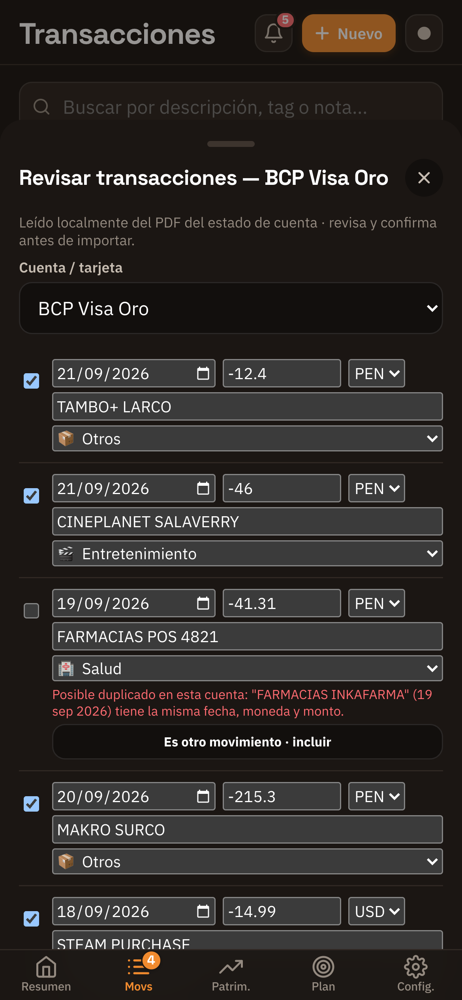</td>
    <td width="33%" valign="top">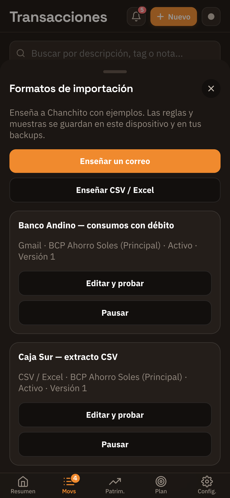</td>
    <td width="33%" valign="top">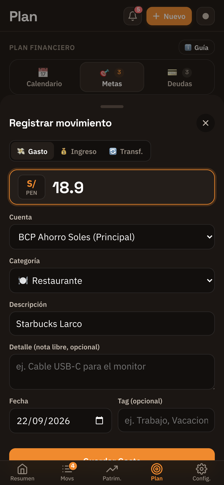</td>
  </tr>
  <tr>
    <td valign="top"><strong>Revisión editable.</strong> CSV/Excel, PDF, foto y Gmail terminan siempre aquí antes de guardar. Detecta duplicados por cuenta + fecha + monto aunque la descripción cambie entre fuentes.</td>
    <td valign="top"><strong>Formatos enseñables.</strong> Enseñas un correo o un CSV nuevo con 2–5 ejemplos, marcas los campos y se prueba contra todos antes de activarse. Sin código, sin IA, con versiones.</td>
    <td valign="top"><strong>Captura desde Apple Pay.</strong> Un Atajo de iOS dispara <code>chanchito://capture</code> con comercio y monto en cada pago con Wallet; la app abre el registro ya prellenado.</td>
  </tr>
</table>

### Control y patrimonio

<table>
  <tr>
    <td width="33%" valign="top">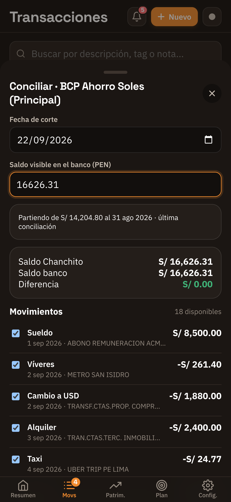</td>
    <td width="33%" valign="top">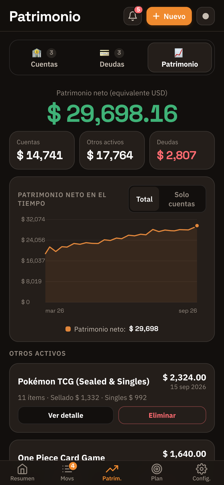</td>
    <td width="33%" valign="top">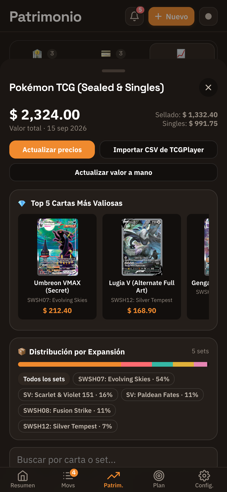</td>
  </tr>
  <tr>
    <td valign="top"><strong>Conciliación auditable.</strong> Parte del último saldo confirmado, eliges los movimientos y solo cierra con diferencia cero. El cierre bloquea esos movimientos y se invalida solo si cambia algo del periodo.</td>
    <td valign="top"><strong>Patrimonio neto en USD.</strong> Cuentas + otros activos − deudas, con historial. "Otros activos" es genérico: una colección, un auto o una propiedad.</td>
    <td valign="top"><strong>Colección ítem por ítem.</strong> Importa el CSV de TCGPlayer, muestra las cartas más valiosas en HD, la distribución por expansión y actualiza precios de mercado.</td>
  </tr>
</table>

### Plan

<table>
  <tr>
    <td width="33%" valign="top">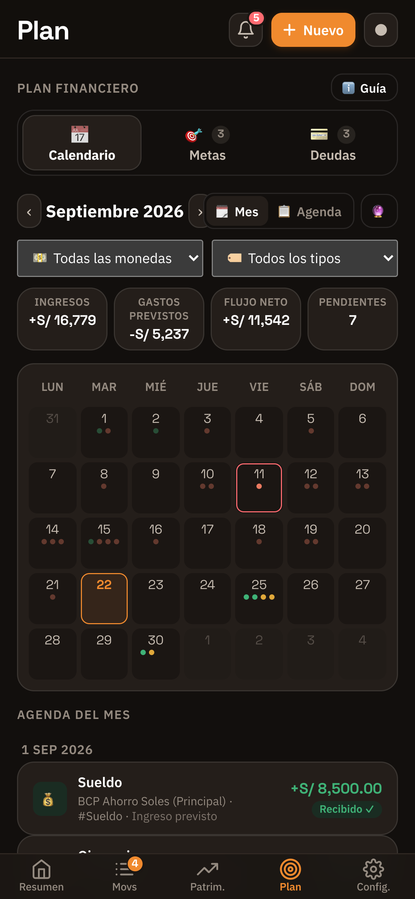</td>
    <td width="33%" valign="top">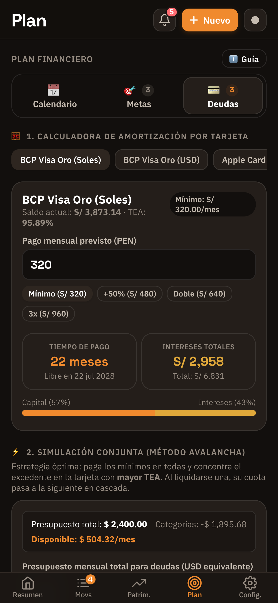</td>
    <td width="33%" valign="top">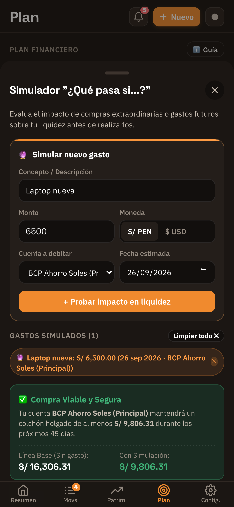</td>
  </tr>
  <tr>
    <td valign="top"><strong>Calendario financiero.</strong> Ingresos, gastos fijos, habituales, cuotas, metas y cierres de estado de cuenta en una vista mensual o agenda, conciliados contra los movimientos reales.</td>
    <td valign="top"><strong>Deudas y avalancha.</strong> Calculadora de amortización por tarjeta con TEA real y simulador conjunto que concentra el excedente del presupuesto en la deuda más cara.</td>
    <td valign="top"><strong>"¿Qué pasa si...?"</strong> Simula un gasto extraordinario sobre la proyección de 45 días: muestra el colchón mínimo, si habría sobregiro y la primera fecha segura.</td>
  </tr>
  <tr>
    <td valign="top">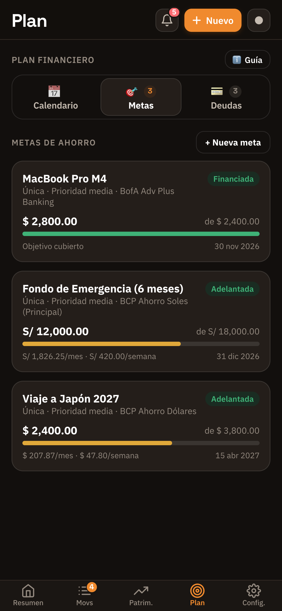</td>
    <td valign="top">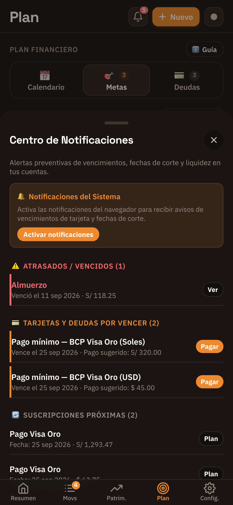</td>
    <td valign="top">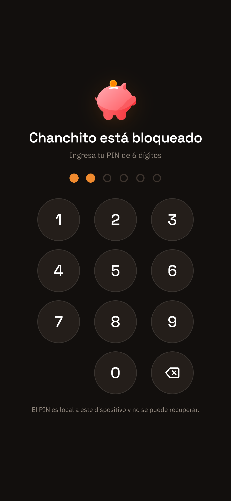</td>
  </tr>
  <tr>
    <td valign="top"><strong>Metas de ahorro.</strong> Asignaciones (no cuentas) con aportes reversibles, ritmo sugerido mensual/semanal y opción "Págate primero" que las descuenta del flujo neto.</td>
    <td valign="top"><strong>Centro de notificaciones.</strong> Pagos vencidos, cuotas por vencer, extractos listos para conciliar y suscripciones próximas, todo calculado en el dispositivo.</td>
    <td valign="top"><strong>Bloqueo local.</strong> PIN de 6 dígitos (PBKDF2-SHA256) al abrir y tras 1 min en segundo plano; en la app de iOS se suma Face ID / Touch ID.</td>
  </tr>
</table>

---

## 💡 El Problema

Los gestores de finanzas comerciales (Mint, YNAB, hojas de cálculo) tienen limitaciones estructurales para usuarios con necesidades particulares:
1. **Multi-moneda y multi-país real**: cuentas en Soles (PEN) y Dólares (USD) a la vez, tarjetas bimoneda y transferencias cruzadas con tipo de cambio.
2. **Bancos sin integración**: en Perú no hay agregadores tipo Plaid; la información llega por correos, PDFs protegidos, exportaciones Excel o capturas.
3. **Deudas complejas**: amortización con TEA/APR real, pagos mínimos y optimización de pago en cascada.
4. **Patrimonio integral**: activos no bancarios (colecciones TCG, vehículos) dentro del patrimonio neto.
5. **Privacidad**: la información financiera personal no debería vivir en servidores de terceros.

---

## ✅ La Solución

**Chanchito** es una Progressive Web App construida a medida con arquitectura *local-first*, empaquetada también como app nativa de iOS:
- **Flujo de caja y presupuestos**: KPIs por moneda, presupuestos con historial y rollover, ritmo de gasto (pacing).
- **Plan financiero predictivo**: calendario unificado, conciliación automática contra movimientos reales, proyección a 45 días y simulador *"¿Qué pasa si...?"*.
- **Gestor de deudas**: calculadora de amortización verificada y simulador Avalancha.
- **Patrimonio neto consolidado**: cuentas + otros activos − deudas en USD con historial.
- **Pipeline de importación por capas**: CSV/Excel con detección de formato, PDFs leídos localmente, OCR → IA solo con confirmación, Gmail (incluidos adjuntos), formatos enseñables y captura automática desde Apple Pay.
- **Contabilidad auditable**: conciliaciones con diferencia cero, control de duplicados y transferencias internas emparejadas.

---

## 🏗️ Decisiones de Arquitectura y Casos Reales

- **Local-first sin concesiones**: cero frameworks, cero bundlers, cero build step. HTML/CSS/JS plano en módulos IIFE cargados en un orden explícito. Todo el estado vive en el almacenamiento local del dispositivo; los datos financieros nunca tocan un servidor propio.
- **Una base de código, dos plataformas**: la app de iPhone es un shell de **Capacitor** que empaqueta exactamente los mismos archivos de la PWA, sin fork. Las diferencias reales viven en plugins nativos pequeños:
  - **Google Sign-In nativo** con restauración silenciosa desde el Keychain, porque Google bloquea su flujo web dentro de WebViews de terceros.
  - **Face ID / Touch ID** vía `LocalAuthentication` como alternativa al PIN, nunca como recuperación.
  - **Almacenamiento estable**: copia atómica de las claves financieras fuera de WebKit y restauración automática si iOS rota el almacenamiento del WebView.
  - **Deep links pendientes**: la URL de un Atajo que llega en arranque en frío se guarda hasta que la interfaz está lista para consumirla.
- **Nunca confiar ciegamente en una extracción**: ningún importador escribe directo. Todo pasa por una pantalla de revisión editable con control de duplicados por cuenta + fecha + moneda + monto y un *fingerprint* canónico que normaliza acentos, puntuación y espacios.
- **IA como último recurso, no como default**: los PDFs con texto (incluidos los protegidos con contraseña) se leen **localmente** con `pdf.js` y reconstrucción posicional de columnas; las imágenes pasan por OCR dedicado; un LLM (Claude Haiku, Gemini u OpenAI con *Bring-Your-Own-Key*) solo entra con confirmación explícita y salida estructurada. Los resultados se cachean por hash SHA-256 del archivo para no pagar dos veces.
- **Formatos enseñables en lugar de código**: un correo o CSV nuevo se enseña con 2–5 ejemplos. La definición resultante son datos (delimitadores y columnas, nunca código ejecutable), se valida contra todos los ejemplos antes de activarse, tiene versiones recuperables y viaja en los backups.
- **Parsers declarativos**: los extractos tabulares se describen con esquemas JSON (columnas, formato de fecha, convención de signo, moneda, saldo corrido) ejecutados por un motor agnóstico, con validación aritmética contra el saldo impreso.
- **Conciliación como auditoría, no como "editar saldo"**: un cierre exige diferencia menor a un centavo, guarda los IDs incluidos y se invalida en cascada ante cambios retroactivos de fecha, monto o moneda. Los movimientos pendientes se arrastran al siguiente cierre.
- **Machine Learning local**: clasificador Naive Bayes con n-gramas, limpieza de ruido bancario, guardrails de *cold start* y margen de decisión mínimo. Las reglas explícitas del usuario siempre tienen precedencia.
- **Transferencias internas**: emparejamiento voraz 1:1 con tolerancia a comisiones y tipos de cambio históricos. La autovinculación solo aplica con certeza total y se puede deshacer en un toque.
- **Backups sin pérdida**: exportación cifrada con **AES-GCM** (clave derivada de contraseña), subida opcional a Google Drive con scope `drive.file`, backup automático al pasar a segundo plano y **fusión de tres vías** para combinar dispositivos sin reemplazar todo.
- **Quirks reales de WebKit/iOS diagnosticados en el dispositivo**: `env(safe-area-inset-*)` en `0` durante el primer layout de una PWA en arranque en frío (resuelto con `max()` a un piso de hardware), destello blanco en modo oscuro y gestos de cierre de *sheets* que competían con el scroll interno.
- **Motor de gráficos propio**: línea, barras, donut y tendencias apiladas en SVG, posicionadas por tiempo real (no por índice) y con tooltips acotados al contenedor de la app.

---

## ✨ Módulos y Funcionalidades

### 1. Resumen
- **Flujo neto** del periodo: lo que realmente entró y salió de las cuentas no-tarjeta, separado del gasto devengado con tarjeta.
- Control diario: extractos listos para conciliar, saldos pendientes y últimos lotes importados (con corrección de año en un paso).
- Próximos compromisos a 14 días resueltos contra movimientos reales.
- Gasto histórico de 6/12 meses, tendencias apiladas por categoría y donut interactivo.
- Proyección de saldo a 45 días con umbral mínimo de seguridad y simulador.
- Reporte mensual imprimible (PDF) y exportación CSV.

### 2. Movimientos
- Búsqueda instantánea y filtros por cuenta, categoría, mes, sin revisar o sin tag.
- Inbox de revisión con badge en tiempo real y triage rápido.
- Selección múltiple y edición masiva atómica (categoría, tag, notas, cuenta, revisión, borrado) con aviso para periodos ya conciliados.
- Último lote importado editable en una sola ventana.

### 3. Patrimonio
- **Cuentas**: saldo proyectado, gráfico histórico, estado de conciliación y día de corte configurable.
- **Deudas**: TEA/APR, mínimos, fechas de pago, conciliación por tarjeta y moneda.
- **Patrimonio neto** consolidado en USD con historial.
- **Otros activos**: snapshots de valor para cualquier activo y detalle ítem por ítem para colecciones TCG (Top 5 en HD, distribución por expansión, actualización de precios de mercado).

### 4. Plan
- **Calendario financiero** mensual y agenda con colores por tipo de compromiso, adopción del monto real cobrado y recordatorios de cierre de estado de cuenta.
- **Metas de ahorro** con ritmo sugerido y "Págate primero".
- **Deudas & Avalancha** con presets de pago y trade-off frente a las metas.
- **Simulador "¿Qué pasa si...?"** con diagnóstico de sobregiro y fecha segura.

### 5. Configuración e importación
- **Importar**: CSV/Excel con detección automática de banco y cuenta, PDF protegido leído localmente, foto/PDF escaneado vía OCR → IA, y sincronización con Gmail (correos de banco y reportes Excel adjuntos de Yape).
- **Formatos de importación** enseñables por correo o tabla.
- **Atajos de iOS**: captura manual desde Siri / botón de acción y automática desde pagos con Apple Pay.
- Reglas de categorización, reglas de tag (planes recurrentes), calidad de datos y reglas sugeridas.
- Backups cifrados locales y en Drive, fusión inteligente y seguridad (PIN, Face ID).

---

## 🛠️ Stack Tecnológico

| Capa | Tecnologías |
| :--- | :--- |
| **Frontend Core** | HTML5, CSS3 moderno (Custom Properties, Safe Areas, `@media print`), JavaScript ES2022 Vanilla, sin frameworks ni bundlers |
| **App nativa** | Capacitor (iOS), plugins Swift propios: almacenamiento estable, biometría, deep links y restauración de Google Sign-In |
| **Persistencia** | `localStorage` con verificación de cuota, integridad referencial y copia nativa en iOS |
| **Seguridad** | Web Crypto API (`PBKDF2` 250 000 iteraciones, `AES-GCM`, `SHA-256`), `LocalAuthentication` en iOS |
| **Integraciones** | Google Identity Services / Sign-In nativo (Gmail y Drive, OAuth en el cliente), Cloudflare Workers (proxy sin estado para OCR/IA) |
| **Procesamiento de documentos** | `pdf.js` local con reconstrucción posicional, SheetJS, Google Vision OCR, Claude Haiku / Gemini / OpenAI con salidas estructuradas |
| **Testing** | 18 suites en Node.js (cálculo financiero, parsers, conciliación, ML, seguridad, backups, deep links) + smoke test de UI con Puppeteer |

---

## 👨‍💻 Rol y Desarrollo

Diseño y desarrollo end-to-end por **Alvaro Oliveros**:
- Arquitectura *local-first* y diseño de experiencia móvil y desktop.
- Motores de cálculo financiero: amortización, proyección de flujo de caja, conciliación contable, presupuestos con rollover y metas de ahorro.
- Pipeline de importación por capas, motor de parsers declarativos, formatos enseñables y clasificador de machine learning local.
- Shell nativo de iOS con plugins propios en Swift.
- Suite completa de pruebas unitarias, de integración y de UI.

---

  <strong>¿Te interesa conocer más sobre la arquitectura o detalles técnicos?</strong> 
  Puedo facilitar acceso puntual al repositorio de desarrollo para procesos de entrevista técnica.

